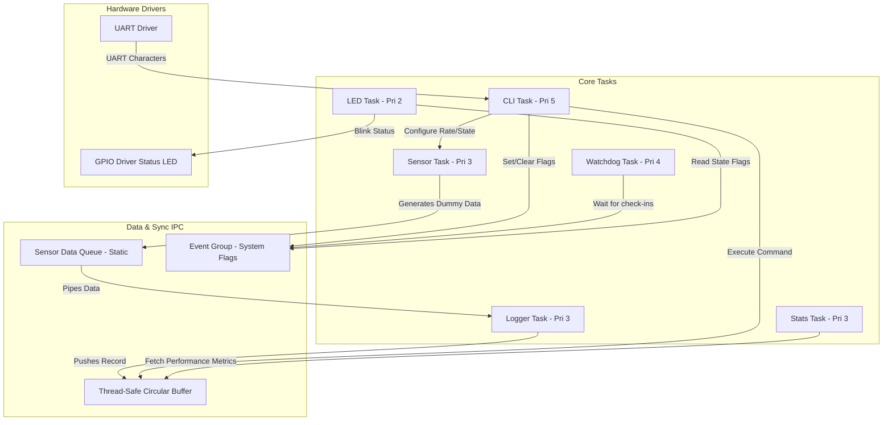

<<<<<<< HEAD
# RTOS-Based Sensor Data Logger with CLI on ESP32-C6

An industrial-grade, multi-tasking sensor data logger implemented in **pure C** on the **ESP32-C6** platform. Built using **FreeRTOS** and **ESP-IDF** within the **PlatformIO** ecosystem, this project demonstrates professional embedded software architecture, robust task synchronization, custom watchdog implementation, thread-safe memory storage, and an interactive command-line interface.

---

## 1. System Architecture Diagram



---

## 2. Directory Structure

The repository maintains a clean separation of concerns:

```
Data_Logging_FreeRTOS_CLI/
├── include/
│   └── README
├── src/
│   ├── config/
│   │   └── config.h         # Compile-time system constants (tasks, priorities, GPIOs)
│   ├── cli/
│   │   ├── cli.h            # Reusable CLI definitions
│   │   └── cli.c            # UART shell handler & interactive command interpreters
│   ├── sensor/
│   │   ├── sensor.h         # Sensor reading definitions & packet structures
│   │   └── sensor.c         # Periodic data generator & watchdog-safe loop
│   ├── logger/
│   │   ├── logger.h         # Logger Task interface
│   │   └── logger.c         # Queue consumer & log formatter
│   ├── storage/
│   │   ├── storage.h        # Storage abstraction layer interface
│   │   └── storage.c        # Thread-safe circular buffer implementation
│   ├── led/
│   │   ├── led.h            # Status LED interface
│   │   └── led.c            # Event-group driven status LED blink task
│   ├── stats/
│   │   ├── stats.h          # Statistics reporter interface
│   │   └── stats.c          # 10-second print task with runtime analysis
│   ├── watchdog/
│   │   ├── watchdog.h       # Watchdog check-in task interface
│   │   └── watchdog.c       # Event-group task check-in validator (starvation prevention)
│   ├── main.c               # System entry, initialization and startup sequence
│   ├── prompt.md            # Original requirements prompt
│   └── CMakeLists.txt       # Recursive source glob CMake configuration
├── platformio.ini           # PlatformIO project configurations (board, framework, flags)
└── README.md                # System documentation manual
```

---

## 3. FreeRTOS & RTOS Concepts Demonstrated

* **Task Priorities & Stack Sizes**: Coherently defined in [config.h](file:///c:/Users/DELL/Desktop/rutvik/PROJECT_CV/RTOS_Based_Sensor_Data_Logger_with_CLI/Data_Logging_FreeRTOS_CLI/src/config/config.h) to ensure time-critical tasks (CLI and Watchdog) interrupt periodic tasks (Logger, Sensor, Stats).
* **Static Allocation**: To guarantee deterministic execution and avoid runtime heap fragmentation, major RTOS objects—including the **Sensor Queue**, **Circular Buffer Lock**, **CLI Lock**, and **System Event Group**—are statically allocated using FreeRTOS static allocation APIs (e.g., `xQueueCreateStatic`, `xSemaphoreCreateMutexStatic`, `xEventGroupCreateStatic`).
* **Event Groups**: Used as the system-wide state flags board:
  - `EVENT_LOGGING_ACTIVE_BIT` (Bit 0): Start/stop sensor packet recording.
  - `EVENT_CLI_ACTIVE_BIT` (Bit 1): Indicates an active CLI command session (changes LED to Solid ON).
  - `EVENT_ERROR_BIT` (Bit 2): Set when watchdog detects a starved task (sets LED to Double Blink).
  - `EVENT_WDT_KICK_xxx_BIT` (Bits 3–6): Used for periodic task check-ins (watchdog kicks).
* **Mutex Lock Protection**: Reentrant and thread-safe API access is maintained across storage operations (via `storage_mutex` in [storage.c](file:///c:/Users/DELL/Desktop/rutvik/PROJECT_CV/RTOS_Based_Sensor_Data_Logger_with_CLI/Data_Logging_FreeRTOS_CLI/src/storage/storage.c)) and CLI registry (via `cli_mutex` in [cli.c](file:///c:/Users/DELL/Desktop/rutvik/PROJECT_CV/RTOS_Based_Sensor_Data_Logger_with_CLI/Data_Logging_FreeRTOS_CLI/src/cli/cli.c)).
* **Queues**: A high-efficiency queue pipes data packets (`sensor_reading_t`) from the **Sensor Task** (producer) to the **Logger Task** (consumer) asynchronously.
* **Watchdog Check-In System**: Rather than resetting on arbitrary loops, all tasks must periodically set their respective bit in `system_event_group`. The watchdog task checks these bits every 15 seconds. If a task becomes stuck or starved, the watchdog prints a clear error indicating the specific task name and flashes the status LED.
* **Dynamic Sleep Slicing**: Tasks with long delays (e.g. 10s Stats or arbitrary Sensor rates) sleep in short 500ms–1000ms increments, allowing them to feed the watchdog continuously and remain highly responsive.

---

## 4. Interactive CLI Command Manual

Connect over serial at **115200 baud**. The CLI prompt is designated by `> `.

| Command | Arguments | Description |
| :--- | :--- | :--- |
| `help` | None | Lists all available commands with helpful instructions. |
| `status` | None | Shows whether logging is active, current sampling rate, number of active sensors, and buffer counts. |
| `start` | None | Activates sensor sampling and records readings to the circular buffer. |
| `stop` | None | Pauses sensor logging. |
| `clear` | None | Flushes the circular buffer and resets all dropped statistics. |
| `logs` | None | Prints all stored sensor logs in a human-readable table format. |
| `log count`| None | Prints the current count of stored records. |
| `sensor list`| None | Lists all sensors (ID, name, enable state, last value, status). |
| `sensor enable`| `<id>` | Enables a sensor by its ID (1 to 4). |
| `sensor disable`| `<id>` | Disables a sensor by its ID (1 to 4). |
| `sensor rate`| `<ms>` | Changes the sampling rate dynamically (e.g., `sensor rate 500`). |
| `memory` / `heap`| None | Displays current free heap and historical minimum heap watermark. |
| `tasks` / `stack`| None | Lists active tasks, states, priorities, stack watermarks, and task ID numbers. |
| `uptime` | None | Prints the system uptime in seconds/milliseconds. |
| `time` | None | Prints the system clock time since boot in `HH:MM:SS` format. |
| `export` | `csv` or `json` | Exports the logged records in standard CSV or JSON format. |
| `stats` | None | Displays detailed diagnostic telemetry (queue depth, dropped logs, memory watermarks). |
| `reboot` | None | Restarts the microcontroller. |

---

## 5. Build and Flash Instructions

### Prerequisites
* VS Code with **PlatformIO IDE** extension installed.
* Python 3 and USB-to-UART drivers for the ESP32-C6 DevKit.

### Compiling Project
Open a terminal in the root folder and run PlatformIO build command:
```bash
# Using the PlatformIO core binary directly:
C:\Users\DELL\.platformio\penv\Scripts\pio.exe run
```

### Uploading & Monitoring
To flash the code and open the serial monitor:
```bash
# Flash the ESP32-C6
C:\Users\DELL\.platformio\penv\Scripts\pio.exe run --target upload

# Run the serial monitor
C:\Users\DELL\.platformio\penv\Scripts\pio.exe device monitor
```
=======
# RTOS-Based-Sensor-Data-Logger-with-CLI
FreeRTOS, Multitasking &amp; Embedded Systems
>>>>>>> 3e917f43c0eb11a4a6f4fbb7e349f7d496d660f8
