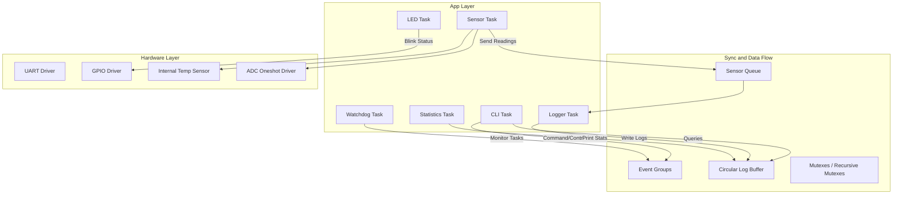

# Implementation Plan: RTOS-Based Sensor Data Logger with CLI

This plan outlines the design and implementation of an industrial-quality RTOS-Based Sensor Data Logger with a UART CLI on the ESP32-C6 using PlatformIO and the ESP-IDF framework.

## User Review Required

> [!IMPORTANT]
> **FreeRTOS Configuration (`sdkconfig`)**
> To support detailed task metrics (via `vTaskList` and `vTaskGetRunTimeStats`), we need to check if the following options are enabled in the ESP-IDF configuration:
> - `configUSE_TRACE_FACILITY`
> - `configGENERATE_RUN_TIME_STATS`
> - `configUSE_STATS_FORMATTING_FUNCTIONS`
> If these config options are disabled, the `tasks` command will display basic info or fallback to a custom task status table, but enabling them provides full diagnostic data. We will check/configure them.

> [!NOTE]
> **Target Board LED**
> The DevKit board typically has an RGB LED (WS2812) or standard LED on GPIO 8. We will implement status indication using standard GPIO toggling on a configurable pin. We will default to `GPIO_NUM_8` (configurable in `config/config.h`).

---

## Proposed Changes

We will implement a clean, modular, layered architecture within the `src/` directory.



### Component Breakdown

#### `src/config/config.h` [NEW]
Provides the compile-time configuration parameters (priorities, stack sizes, UART baudrate, buffer capacities, sampling rate).

#### `src/storage/storage.h` & `src/storage/storage.c` [NEW]
Defines the `sensor_log_t` struct and implements the thread-safe circular log buffer with mutex protection.
- Supports adding logs, retrieving logs, clearing logs, counting logs, and calculating drops.
- Designed as an abstract interface to allow future SPI Flash, SD Card, or NVS backend additions.

#### `src/sensor/sensor.h` & `src/sensor/sensor.c` [NEW]
Defines standard sensor configurations (enabled state, ID, rate, reading functions).
- Periodically reads the Internal Temp sensor (using ESP32-C6 `temperature_sensor` driver) and simulated ADC sensors (Light/LDR and simulated Sine-wave/BMP).
- Sends formatted `sensor_reading_t` items to the logger queue.
- Protected by a mutex to allow safe run-time enablement, disablement, and rate adjustments via CLI commands.

#### `src/logger/logger.h` & `src/logger/logger.c` [NEW]
Runs the Logger Task which blocks on the sensor queue.
- When readings are received, it formats and pushes them to the circular log buffer.
- Manages log drop tracking and logs state changes.

#### `src/cli/cli.h` & `src/cli/cli.c` [NEW]
Implements a modular, reusable CLI interpreter.
- Configures UART0 in raw mode, handling echo, backspace, and line endings.
- Manages command registration and executes handlers with argument tokens.
- Implements interactive commands: `help`, `status`, `start`, `stop`, `clear`, `logs`, `log count`, `sensor list`, `sensor enable/disable/rate`, `memory`, `tasks`, `heap`, `stack`, `uptime`, `reboot`, `version`, `time`, `export`, and `stats`.

#### `src/led/led.h` & `src/led/led.c` [NEW]
Blinks a status LED to reflect the current state (Idle, Active Logging, Error, CLI active).
- Reads system state flags from the global event group.

#### `src/stats/stats.h` & `src/stats/stats.c` [NEW]
Implements the Statistics Task which prints overall performance diagnostics every 10 seconds (CPU Load, Free Heap, Tasks, Log queues, Uptime, dropped logs).

#### `src/watchdog/watchdog.h` & `src/watchdog/watchdog.c` [NEW]
Implements a custom Watchdog Task monitoring queue overflows, tasks check-ins (task starvation), and sensor failures.
- Interacts with FreeRTOS Event Groups.

#### `src/main.c` [MODIFY]
Entry point: initializes all resources, queues, semaphores, registers all CLI commands, and creates all FreeRTOS tasks.

---

## Verification Plan

### Automated & Manual Verification
1. **Compilation**: Compile with PlatformIO to ensure zero compiler warnings/errors:
   ```bash
   C:\Users\DELL\.platformio\penv\Scripts\pio.exe run
   ```
2. **Interactive CLI Shell**: Verify that connecting over serial (115200 baud) presents a shell prompt (`> `).
3. **Commands Verification**:
   - `help` -> check output format.
   - `sensor list`, `sensor enable`, `sensor disable`, `sensor rate` -> check config modifications.
   - `start` & `stop` -> verify logging halts and resumes.
   - `logs` & `export` -> check CSV/JSON formatting.
   - `stats` & `tasks` -> inspect CPU, stack, heap, and queue usage.
   - `reboot` -> check software restart.
4. **Error Handling**: Verify behavior during invalid commands, queue fullness (using a stress rate of 1ms), and invalid arguments.
